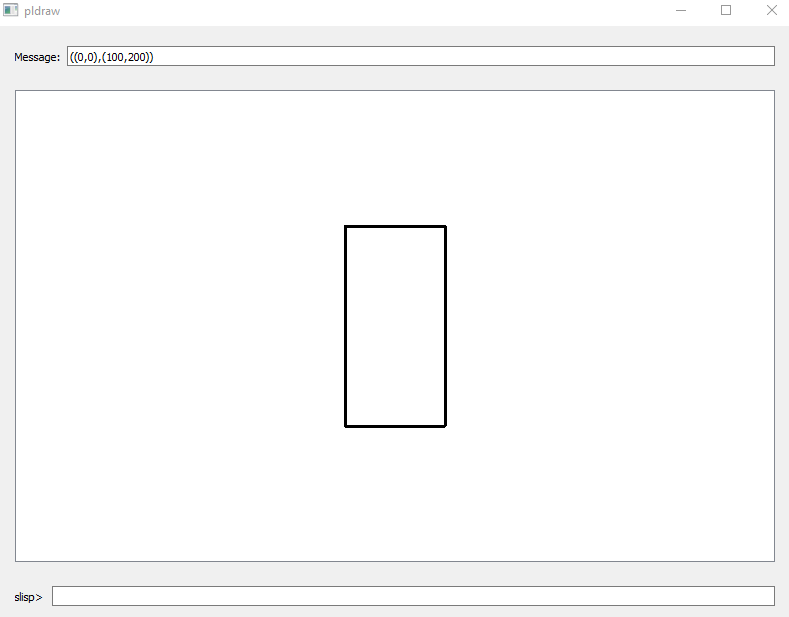
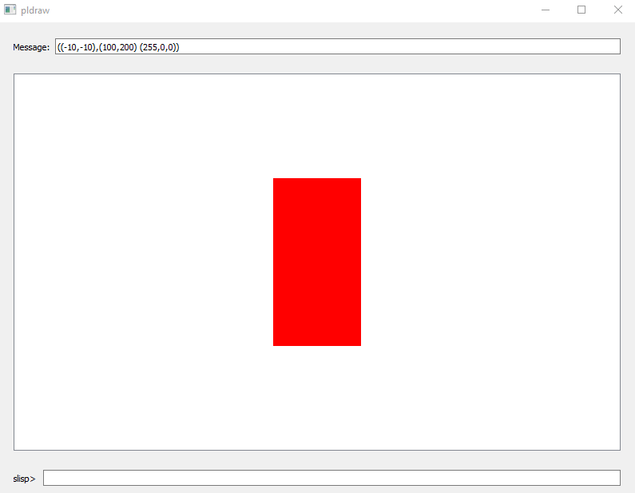
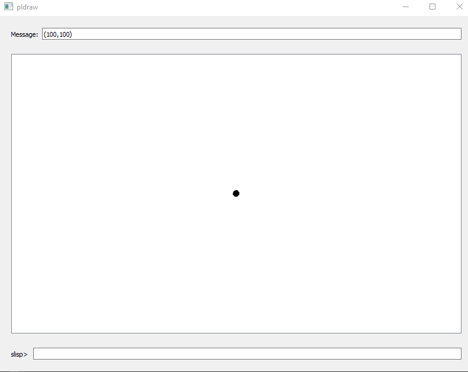
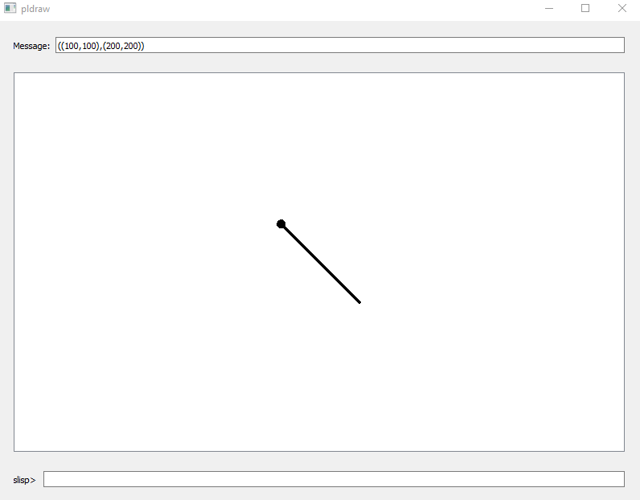
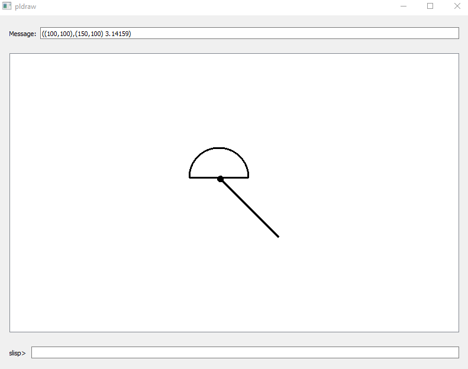
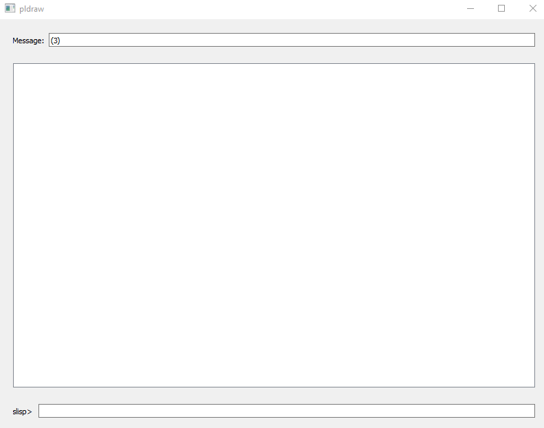

# **pldraw**

pldraw (project from Applied Software Design) is a Qt-based graphical application that integrates a custom Lisp-like interpreter to perform arithmetic computations, define variables, and draw graphics. In addition to basic drawing commands, the interpreter supports a comprehensive set of mathematical operations.

## Features
 - **Custom Interpreter:**

    Execute expressions written in a Lisp-like syntax to carry out calculations and manage variables.
- **Mathematical Operations:**
Perform various arithmetic operations, including:

    - **Addition (`+`):** Sum two or more numbers.
    - **Subtraction (`-`):** Subtract one number from another or negate a single number.
    - **Multiplication (`*`):** Multiply two or more numbers.
    - **Division(`/`):** Divide one number by another (division by zero is handled as an error).
    - **Square Root (`sqrt`):** Calculate the square root of a non-negative number.
    - **Logarithm Base 2 (`log2`):** Compute the base-2 logarithm of a positive number.
    - **Trigonometric Functions:** Compute sine (`sin`), cosine (`cos`), and arctan (`arctan`) values (angles in radians).

- **Graphics:**
Draw a variety of graphical shapes, including:
    - **Points**: Represented as small circles.
    - **Lines**: Drawn between two defined points.
    - **Arcs**: Rendered using a custom arc item.
    - **Rectangles**: Outlined shapes defined by two corner points.
    - **Filled Rectangles**: Rectangles that are filled with a specified RGB color.
    - **Ellipses** : Derived from defined rectangular boundaries.

## Build Instructions
1. **Clone the Repository:**

    `git clone <repository-url>`

    `cd pldraw`

2. **Configure and Build (CMake):**

    `mkdir build`

    `cd build`

    `cmake ..`

    `make`

3. **Run the Application:**

    When you run pldraw, commands are inputed in the `slisp>` line, meanwhile the graphical outputs are displayed in the middle canvas, and the outputs are on the `Message:` line. 

## Usage Examples
### Graphical Commands
- **Rectangle:**
    
    Creates a rectangle defined by two points.

    `(((0 0 point) (100 200 point) rect) draw)`
    

- **Filled Rectangle:**

    Creates a rectangle and fills it with an RGB color.

    `(((( -10 -10 point) (100 200 point) rect) 255 0 0 fill_rect) draw)`

- **Point:**

    `((50 50 point) draw)`

- **Line:**

    `(((50 50 point) (150 150 point) line) draw)`
    

- **Arc:**

    `(((100 100 point) (150 100 point) pi arc) draw)`
    

- **Ellipse:**

    `((((0 0 point) (100 50 point) rect) ellipse) draw)`
    

### **Mathematical Operations** (Outputs are on the messgae line)

- **Arithmetic:**

    `(1 2 +)`        ; Addition: Evaluates to 3  
    `(5 -)`          ; Negation: Evaluates to -5  
    `(10 4 -)`       ; Subtraction: Evaluates to 6  
    `(3 4 *)`        ; Multiplication: Evaluates to 12  
    `(8 2 /)`      ; Division: Evaluates to 4

- **Math Functions:**

    `(9 sqrt)`       ; Square root: Evaluates to 3  
    `(8 log2)`       ; Log base 2: Evaluates to 3  
    `(0 sin)`        ; Sine: Evaluates to 0  
    `(pi cos)`       ; Cosine: Evaluates to -1 (assuming pi is defined)  
    `(1 0 arctan)`   ; Arctan: Evaluates to an angle (e.g., π/2)

- **Relational & Logical Operators:**
Compare values using `<`, `<=`, `>`, `>=`, `==` and combine booleans using and, or, not.

